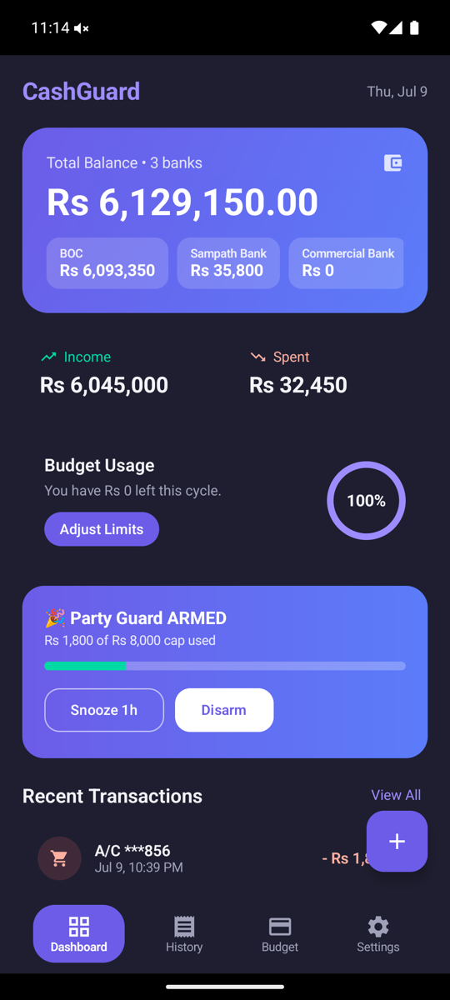
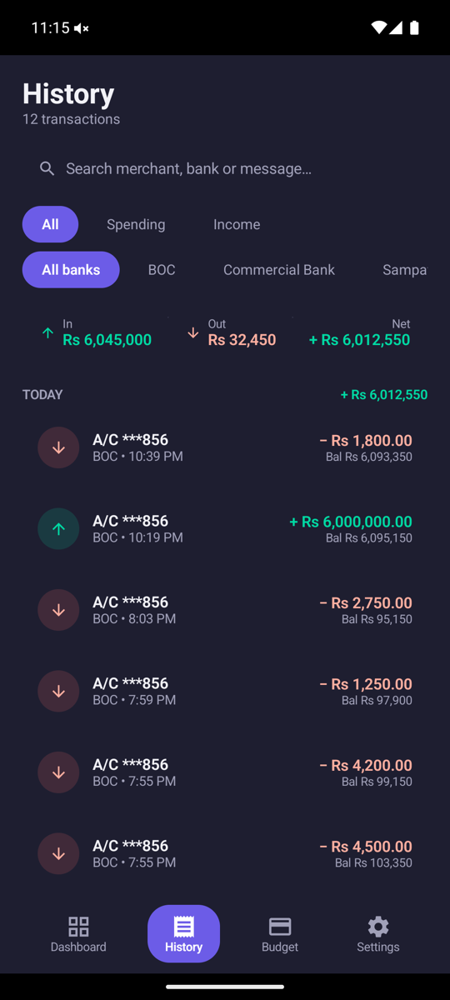
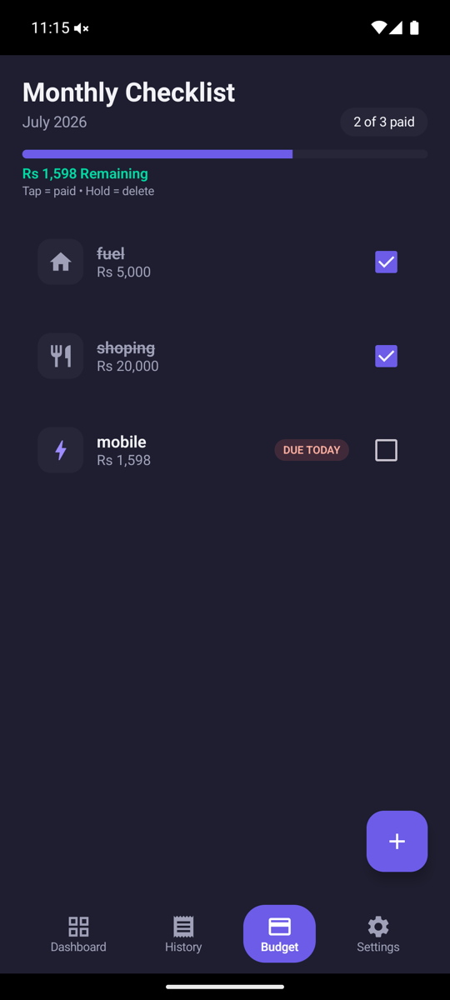
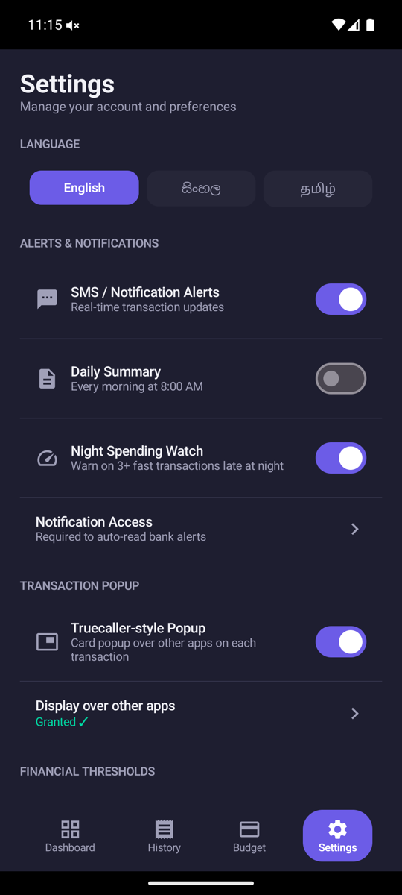
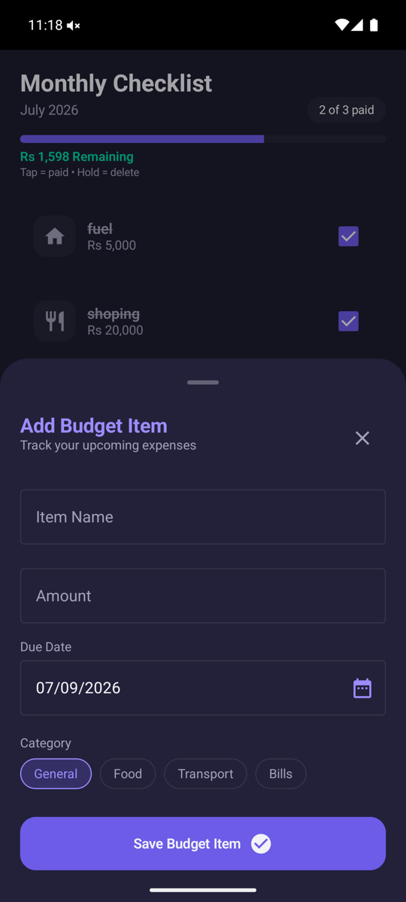
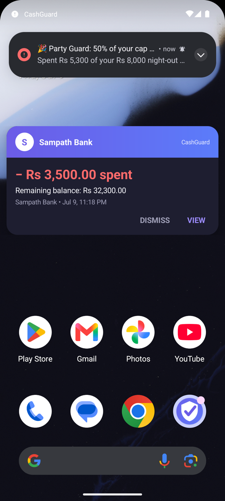

<p align="center">
  
</p>

<h1 align="center">CashGuard</h1>

<p align="center">Personal finance tracker for Sri Lankan bank/telco alerts.<br/>Kotlin + Jetpack Compose + Room + DataStore.</p>

## Screenshots

| Dashboard | History | Budget |
|:---:|:---:|:---:|
|  |  |  |

| Settings | Add Budget Item | Transaction Popup |
|:---:|:---:|:---:|
|  |  |  |

## Features
- **Automatic transaction capture** — a `NotificationListenerService` reads bank
  alert notifications (whether they arrive as SMS via your messaging app or as
  push notifications from the bank app itself), parses amount + balance with regex,
  and stores each transaction in a local Room database. No SMS permission needed.
- **All Sri Lankan banks supported** — alerts from every licensed commercial bank
  (BOC, People's Bank, Commercial Bank, Sampath, HNB, Seylan, DFCC, Nations Trust,
  NDB, Pan Asia, Union Bank, Cargills, Amana), every licensed specialised bank
  (NSB, RDB, SDB, SMIB, HDFC, Sri Lanka Savings Bank), foreign banks operating in
  Sri Lanka (HSBC, Standard Chartered, Citibank, Deutsche Bank, SBI, Indian Bank,
  Indian Overseas Bank, Habib Bank, MCB, Bank of China, Public Bank Berhad) and
  Hutch/SLTMobitel are recognised by sender id or message wording.
- **Instant alert popup** — every parsed transaction triggers a high-priority
  heads-up notification showing amount spent/received and remaining balance.
  A separate low-balance warning fires if the balance drops under your threshold.
- **Monthly budget checklist** — add your recurring bills (rent, electricity,
  loans, etc.). When a matching transaction is detected (by amount or merchant
  name), the item is automatically checked off.
- **Dashboard** — current balance, income vs spend this month, budget usage ring.
- **Transaction history** — searchable, filterable (All/Spending/Income), grouped by day.
- **Multi-bank, zero configuration** — nothing to select: alerts from every
  supported bank are captured automatically. The dashboard tracks a separate
  running balance per bank and shows the total across all of them; History
  can filter by bank.
- **Flexible payday cycles** — everyone gets paid differently, so this is
  opt-in. Add the day(s) of the month your income arrives in Settings and the
  budget checklist + "this cycle" stats reset on payday instead of the 1st.
  Leave it empty and it's a plain calendar month — no configuration required.
- **Trilingual** — English, Sinhala (සිංහල) and Tamil (தமிழ்), picked at
  first launch and switchable any time in Settings.
- **Settings** — toggle alerts, set the low-balance threshold, configure
  payday dates.
- **Party Guard** — arm it before a night out with a spending cap: warnings
  at 50% / 80%, an alarm-sound alert on every transaction past the cap, a
  1-hour snooze gated behind a 30-second cool-down (deliberate friction),
  night-time velocity detection (3+ debits or Rs 15k within an hour between
  8 PM–5 AM even when not armed), and an 8 AM morning-after summary that
  auto-disarms the guard.
- **Truecaller-style popup** — with "Display over other apps" granted, each
  transaction shows a branded overlay card (gradient header, amount,
  remaining balance, View/Dismiss) over whatever app is open; swipe to
  dismiss, auto-hides in 8 s. Falls back to the plain notification without
  the permission — the popup, CashGuard's own notification, and the
  underlying SMS app's banner never all show together; the card clears the
  other two automatically.
- **Privacy-first, open source** — no internet permission, no analytics, no
  ads. Every transaction stays in a local Room database on your device.

## Roadmap

See [ROADMAP.md](ROADMAP.md) for ideas not yet implemented (app PIN,
quick-settings tile, trusted-friend SMS, card-freeze deep links).

## Setup

1. Open this folder in **Android Studio** (Koala or newer recommended).
2. Let Gradle sync (`./gradlew assembleDebug` also works from the command line).
3. Run on a device or emulator with **API 26+**.
4. On first launch, go to **Settings → Notification Access** and grant
   CashGuard access under *Settings → Apps → Special app access →
   Notification access* — this is what lets it read bank alerts.

## Project structure

```
app/src/main/java/com/cashguard/app/
├── data/            Room entities, DAOs, database, settings (DataStore), repository,
│                    CycleCalculator (payday-aware budget cycle math)
├── notification/    NotificationListenerService + regex-based bank message parser
├── guard/           Party Guard manager + morning-summary receiver
├── overlay/         Truecaller-style transaction popup window
├── ui/
│   ├── theme/       Colors, typography, Material3 theme
│   ├── i18n/        Strings.kt — English/Sinhala/Tamil UI text
│   ├── components/  BottomNavBar, TransactionAlertDialog, AddBudgetItemSheet
│   ├── screens/      Onboarding, Dashboard, History, Budget, Settings
│   └── navigation/  Simple tab-based nav graph
├── viewmodel/       MainViewModel (single shared view model)
└── MainActivity.kt
```

## Notes on the notification parser

`BankMessageParser.parse()` is keyword-driven rather than tied to one bank's
template, so it handles the different alert wordings used across banks:

> No Book Deposit S/A Rs 28775.00 To A/C No XXXXXXXXXX856.
> Balance available Rs 28849.03 - Thank you for banking with BOC

> Purchase at KEELLS SUPER for LKR 2,500.00 on 09/07/26 from card ending #4321

> Your A/C **1234 is debited with LKR 5,000.00 on 09-Jul-26. Avl Bal: LKR 20,000.00

It identifies the bank from the SMS sender id (or message wording), extracts
the transaction amount (`Rs` / `LKR`, either side of the figure), resolves the
running balance from any of the common phrasings (`Balance available`,
`Available Balance`, `Avl Bal`, `Bal:`, `Current/Account balance` …), and
classifies CREDIT vs DEBIT by whichever keyword appears first (so "debited …
and credited to beneficiary" is correctly treated as money leaving your
account). Card purchase alerts that omit a balance fall back to the last
known balance. OTP and promotional messages are ignored.

Unit tests with sample messages for each bank live in
`app/src/test/java/com/cashguard/app/notification/BankMessageParserTest.kt` —
run them with `./gradlew testDebugUnitTest`. To add a new sender id or
wording, extend `SUPPORTED_BANKS` / the keyword lists in `BankMessageParser.kt`.

**If a bank's SMS sender ID isn't in `SUPPORTED_BANKS`** the transaction is
still captured — the parser falls back to matching a bank name mentioned in
the message body, and if neither matches, it still records the transaction
under the raw sender ID as an unrecognised "bank". Nothing is silently
dropped; worst case a bank just doesn't get its friendly display name yet
(see the fallback tests in `BankMessageParserTest.kt`).

## Testing without real bank alerts

`MainViewModel.simulateTransaction(...)` inserts a fake transaction and
runs it through the same budget-matching + alert-notification pipeline —
useful for testing the UI before wiring up a real device with notification
access.

### End-to-end testing on an emulator

```bash
./gradlew assembleDebug
adb install -r app/build/outputs/apk/debug/app-debug.apk

# Grant notification access (same as the Settings toggle)
adb shell cmd notification allow_listener \
  com.cashguard.app/com.cashguard.app.notification.BankNotificationListenerService

# Android 15+ ONLY: exempt CashGuard from sensitive-notification redaction,
# then re-toggle the listener so the new trust state is picked up
adb shell appops set com.cashguard.app RECEIVE_SENSITIVE_NOTIFICATIONS allow
adb shell cmd notification disallow_listener \
  com.cashguard.app/com.cashguard.app.notification.BankNotificationListenerService
adb shell cmd notification allow_listener \
  com.cashguard.app/com.cashguard.app.notification.BankNotificationListenerService

# Simulate an incoming bank SMS
adb emu sms send BOC "Withdrawal Rs 500.00 From A/C No XXXXXXXXXX856. Balance available Rs 83750.00 - Thank you for banking with BOC"
```

Watch `adb logcat -s CashGuardListener` to see each notification being
picked up and whether it parsed.

### Android 15+ sensitive-notification redaction

Android 15 hides "sensitive" notification content (OTPs, bank alerts with
masked account numbers) from notification listeners. If logcat shows
*"Bank alert content was redacted"*, the fix on a development device is the
`appops` command above. On production devices without adb this protection
cannot be bypassed by the app itself; alerts that Android doesn't classify
as sensitive (e.g. card purchase alerts) still come through.
